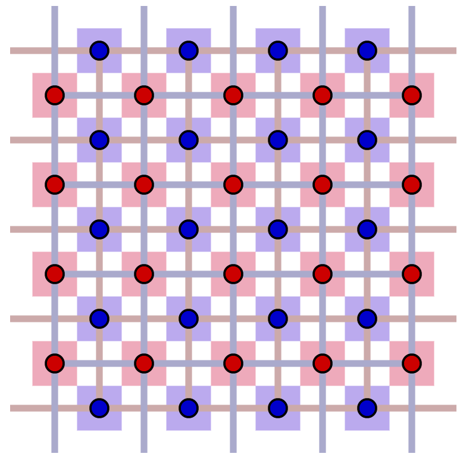
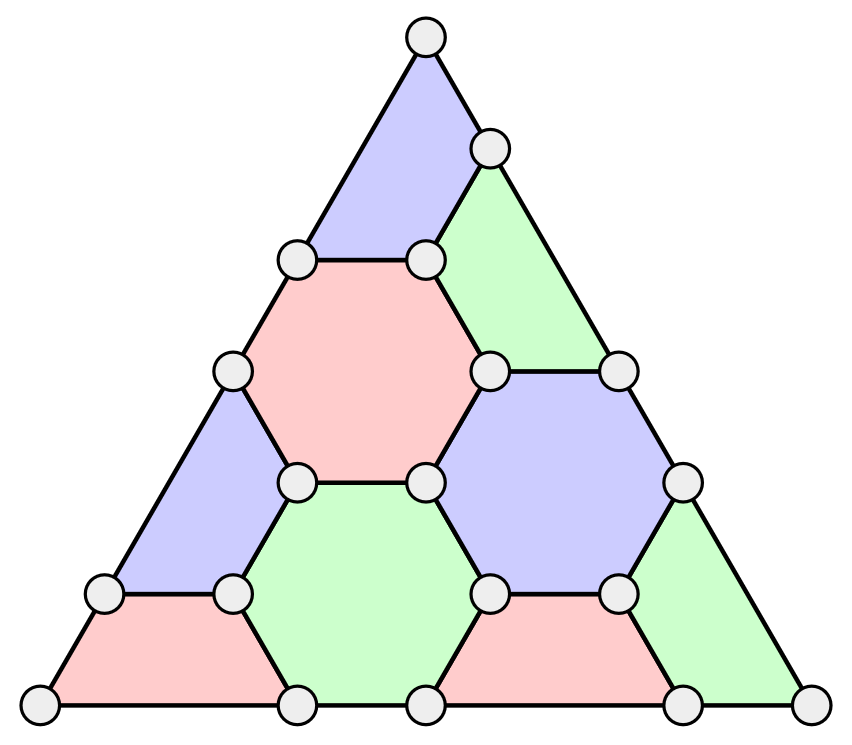

# gitbook-plugin-surfacecode
Honkit plugin for visualizing topological codes, such as surface code and color code. Converting ` ... ` tags to the SVG image of quantum circuits using [two.js](https://two.js.org/). The SVG elements are interactive, i.e., we can switch Pauli errors and stabilizer operators by clicking appropriate elements.

## Install

`package.json`:

```json
{
    "devDependencies": {
        "gitbook-plugin-surfacecode": "git+https://github.com/kodack64/gitbook-plugin-surfacecode",
    }
}
```

`book.json`:

```json
{
	"plugins": [
		"surfacecode"
	]
}
```

then run `npm update` and `npx honkit serve`.

## Example

By inserting json-like object among the markdown, an interactive SVG components will be automatically inserted.

```

{
    size: 400,
    type: "surface_code",
    distance: 5,
    show_primal: true,
    show_dual: true,
}

```



```

{
    size: 400,
    type: "color_code_666",
    distance: 5,
}

```



## Format

- `distance (int)`: (required) code distance.
- `type (str)`: (required) Name of topological codes. Any of `["surface_code", "surface_code_rotate", "surface_code_periodic", "color_code_666", "color_code_666_periodic"]`.
- `bind_error (bool)`: (default to true) If true, users can switch error status of qubits by clicking edges for surface codes and vertices for color codes.
- `bind_stabilizer (bool)`: (default to true) If true, users can perform stabilizer operators by clicking faces of codes.
- `initial_error (list[int] or list[list[int]])`: (optional) Indices of errornous qubits. In the case of surface codes, this value must be pair of lists for primal and dual lattices.
- `initial_syndrome (list[int] or list[list[int]])`: (optional) Indices of active faces. In the case of surface codes, this value must be pair of lists for primal and dual lattices.
